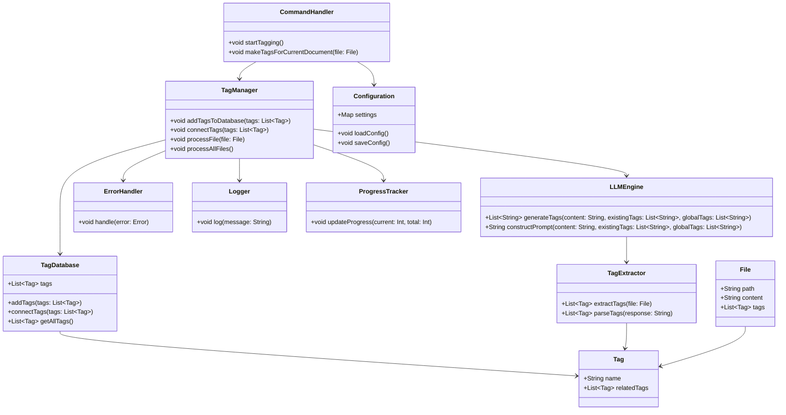
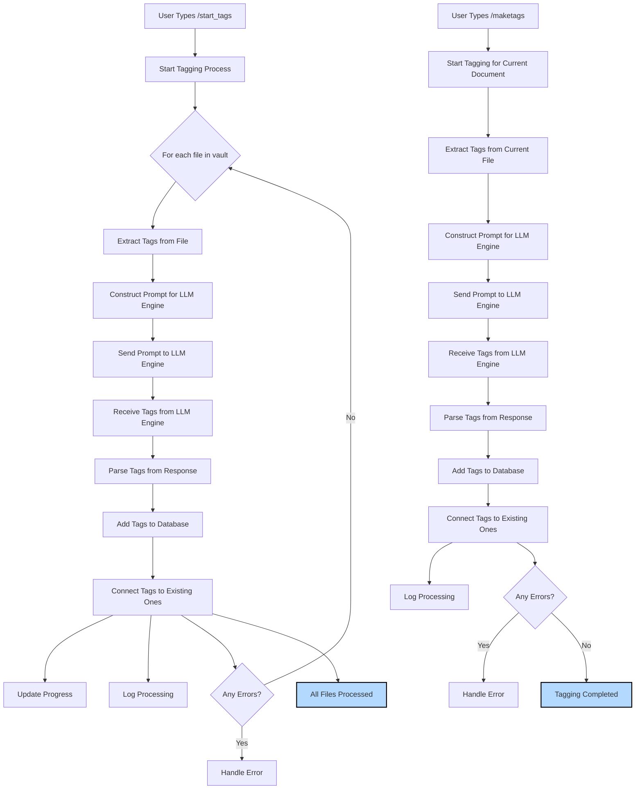

# Obsidian-Auto-Tagger

The Obsidian MD Tagging Plugin is designed to automatically extract and manage tags for documents within your Obsidian vault. This plugin uses a Language Learning Model (LLM) engine to analyze document content, suggest relevant tags, and maintain a database of tags for consistency and ease of use.

## Features

- **Automatic Tag Extraction**: Extracts tags from document content using an LLM engine.
- **Tag Database Management**: Adds new tags to a centralized database and connects them to existing tags.
- **User Commands**: Supports commands to start the tagging process for all files or individual documents.
- **Error Handling and Logging**: Implements robust error handling and logging for better maintainability.
- **Progress Tracking and Feedback**: Provides progress updates to the user during processing.
- **Configuration Management**: Allows customization of plugin settings.
- **Caching**: Improves performance by caching frequently accessed data.

## Architecture

### Components

1. **Tag**: Represents individual tags and their relationships.
2. **File**: Represents files in the Obsidian vault, including their content and associated tags.
3. **TagDatabase**: Stores and manages tags, including adding new tags and connecting them to existing ones.
4. **TagExtractor**: Extracts tags from files using the LLM engine.
5. **LLMEngine**: Interacts with the LLM engine to generate tags based on the content and existing/global tags.
6. **TagManager**: Manages the overall tag processing flow, including interaction with the LLM engine.
7. **CommandHandler**: Handles user commands to start the tagging process and to create tags for the current document.
8. **ErrorHandler**: Handles all errors across the system, ensuring robust error management.
9. **Logger**: Logs important events and errors for debugging and monitoring.
10. **Configuration**: Manages configuration settings, making the plugin customizable.
11. **ProgressTracker**: Tracks and reports progress to the user, improving user experience.

### Class Diagram



### Process Flow

#### Initial Tagging Process (`/start_tags` Command)

1. User types `/start_tags`.
2. The system starts the tagging process for all files in the vault.
3. For each file:
    - Extract tags from the file.
    - Construct the prompt for the LLM engine.
    - Send the prompt to the LLM engine.
    - Receive tags from the LLM engine.
    - Parse tags from the response.
    - Add the tags to the database.
    - Connect the tags to existing ones.
    - Log the processing.
    - Update the progress.
    - Handle any errors.
4. The process completes once all files are processed.

#### Tagging New Documents (`/maketags` Command)

1. User types `/maketags` in a new document.
2. The system starts the tagging process for the current document.
3. For the current file:
    - Extract tags from the file.
    - Construct the prompt for the LLM engine.
    - Send the prompt to the LLM engine.
    - Receive tags from the LLM engine.
    - Parse tags from the response.
    - Add the tags to the database.
    - Connect the tags to existing ones.
    - Log the processing.
    - Handle any errors.
4. The process completes once the current document is tagged.

### Process Flow Diagram



## Getting Started

### Prerequisites

- Ensure you have Obsidian MD installed.
- Familiarity with JavaScript and plugin development for Obsidian MD.
- Access to an LLM engine (e.g., OpenAI GPT-3) that can process prompts and return tag suggestions.

### Installation

1. Clone the repository to your local machine.
2. Navigate to the plugin directory in your Obsidian vault.
3. Copy the plugin files to the directory.
4. Enable the plugin from the Obsidian settings.

### Configuration

The plugin includes a configuration component to manage settings. You can customize the settings by editing the configuration file or through the plugin settings in Obsidian.

**Example Configuration:**
```javascript
class Configuration {
    constructor() {
        this.settings = {
            // Add your custom settings here
            "llmEngineEndpoint": "https://api.openai.com/v1/engines/davinci-codex/completions",
            "apiKey": "your-api-key",
            "maxTags": 7
        };
    }

    loadConfig() {
        // Load settings from a configuration file or local storage
        this.settings = { /* ... */ };
    }

    saveConfig() {
        // Save settings to a configuration file or local storage
    }
}
```

### Usage

#### Commands

- **/start_tags**: Starts the tagging process for all files in the vault.
- **/maketags**: Starts the tagging process for the current document.

**Example:**
```javascript
const commandHandler = new CommandHandler();
commandHandler.startTagging();
```

### Development

#### Code Structure

- **TagExtractor**: Handles tag extraction logic.
- **LLMEngine**: Interacts with the LLM engine for tag generation.
- **TagManager**: Manages the overall tag processing flow.
- **CommandHandler**: Handles user commands.
- **ErrorHandler**: Manages error handling.
- **Logger**: Logs events and errors.
- **Configuration**: Manages plugin settings.
- **ProgressTracker**: Tracks and reports progress.

#### Example Code Snippets

**LLM Engine Interaction:**
```javascript
class LLMEngine {
    async generateTags(content, existingTags, globalTags) {
        const prompt = this.constructPrompt(content, existingTags, globalTags);
        try {
            const response = await sendToLLMEngine(prompt);
            return TagExtractor.parseTags(response);
        } catch (error) {
            ErrorHandler.handle(error);
            return [];
        }
    }

    constructPrompt(content, existingTags, globalTags) {
        return `
        You are an AI assistant specialized in analyzing text and suggesting relevant tags. Your task is to analyze the given content and suggest appropriate tags. Here are your instructions:

        1. Analyze the content thoroughly.
        2. Consider the existing tags (if any) and the global tags used across the knowledge base.
        3. Suggest tags that accurately represent the main themes, concepts, and topics in the content.
        4. Prefer using existing global tags when they fit, to maintain consistency across the knowledge base.
        5. Create new tags only when necessary to capture important concepts not covered by existing tags.
        6. Aim for specificity and relevance in your tag suggestions.
        7. Avoid overly generic tags unless they are particularly relevant to the content.
        8. Suggest between 3 to 7 tags, depending on the content's complexity and length.

        Content:
        ${content}

        Existing tags: ${existingTags.join(', ')}
        Global tags: ${globalTags.join(', ')}

        Please provide your tag suggestions in a comma-separated list:`;
    }
}
```

**Tag Extraction:**
```javascript
class TagExtractor {
    extractTags(file) {
        // Logic to extract content from the file
        const content = file.content;
        const existingTags = file.tags;
        const globalTags = TagDatabase.getAllTags();

        // Generate tags using the LLM engine
        return LLMEngine.generateTags(content, existingTags, globalTags);
    }

    parseTags(response) {
        // Parse the LLM engine response to extract tags
        return response.split(",").map(tag => tag.trim());
    }
}
```

**Error Handling:**
```javascript
class ErrorHandler {
    handle(error) {
        Logger.log(`Error occurred: ${error.message}`);
        console.error(error);
    }
}
```

**Progress Tracking:**
```javascript
class ProgressTracker {
    updateProgress(current, total) {
        const progress = (current / total) * 100;
        console.log(`Progress: ${progress.toFixed(2)}%`);
    }
}
```

## Contribution

Feel free to fork the repository and submit pull requests. For major changes, please open an issue first to discuss what you would like to change.

## License

This project is licensed under the MIT License.

---

This detailed README should provide developers with a comprehensive understanding of the Obsidian MD Tagging Plugin, including its architecture, components, and usage. It is designed to facilitate easy development and contribute to the plugin effectively.
